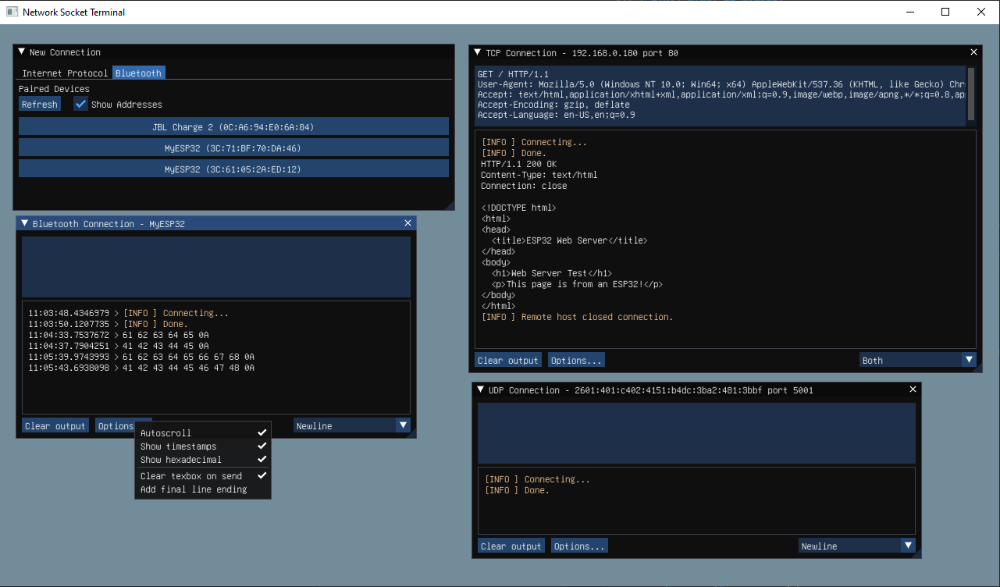

# Network Socket Terminal

**Network Socket Terminal** (NST) is an application for Internet and Bluetooth communication on Windows and Linux computers.

*Note: This software is currently in alpha status. All feedback/feature requests welcome.*

## Documentation Links

- [Building from Source](docs/BUILDING.md)
- [IDE Extensions](docs/EXTENSIONS.md)
- [Screenshots](docs/SCREENSHOTS.md)
- [Todo List](docs/TODO.txt)

## Development Branch

The [`dev` branch](https://github.com/NSTerminal/terminal/tree/dev) is used for in-progress features. Updates can vary in maturity; **the branch is not guaranteed to compile or run properly.**

When a feature is merged into `main` it is ready for release.

## License

NST and its build scripts are licensed under the [GPLv3+ license](COPYING).

## Libraries and Dependencies

- BlueZ (GNU GPLv2+) [Website](http://www.bluez.org/) | [GitHub](https://www.github.com/bluez/bluez)
- Dear ImGui (MIT License) [GitHub](https://www.github.com/ocornut/imgui)
- {fmt} (MIT License) [Website](https://fmt.dev/) | [GitHub](https://www.github.com/fmtlib/fmt)
- GLFW (Zlib License) [Website](https://www.glfw.org/) | [GitHub](https://www.github.com/glfw/glfw)
- GNU Unifont (Dual-Licensed) [Website](https://www.unifoundry.com/unifont) | [Sources](https://www.unifoundry.com/unifont/unifont-utilities.html) | [Mirror on GitHub](https://www.github.com/NSTerminal/unifont)
- libdbus (GNU GPLv2+) [Website](https://www.freedesktop.org/wiki/Software/dbus)
- Magic Enum (MIT License) [GitHub](https://github.com/Neargye/magic_enum)
- ztd.out_ptr (Apache-2.0 License) [GitHub](https://github.com/soasis/out_ptr)

*GNU Unifont is dual-licensed under the GNU GPLv2+ with font embedding exception, and the SIL OFL v1.1.*
