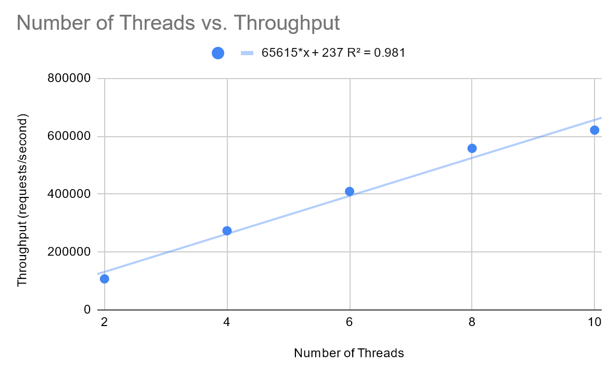

# WhaleConnect Benchmarks

This document outlines the scalability and performance of a small HTTP server written with the same networking/async core code as WhaleConnect.

## Testing Devices

Tests were run on the following machines as servers:

- Model: Custom-built desktop
  - Operating system: Windows 11 Pro 23H2 (build 22631.3737)
  - CPU: AMD Ryzen 7 2700X, 16 logical processors @ 3.7 GHz
  - Memory: 64 GB DDR4 @ 2133 MHz
  - Ethernet adapter: 1000 Mb/s
  - C++ compiler: Microsoft Visual C++ 19.40.33811
- Model: 2021 MacBook Pro, 14-inch
  - Operating system: macOS Sonoma 14.5.1
  - CPU: Apple M1 Pro, 8 logical processors @ 3.2 GHz
  - Memory: 16 GB LPDDR5; 200 GB/s memory bandwidth [4]
  - Ethernet adapter: 1000 Mb/s (external USB 3 adapter)
  - C++ compiler: Apple Clang 15.0.0 (clang-1500.3.9.4)
- Model: Custom-built desktop
  - Operating system: Ubuntu 24.04 (Linux kernel 6.8)
  - CPU: AMD Ryzen 7 2700X, 16 logical processors @ 2.2 GHz
  - Memory: 64 GB DDR4 @ 2133 MHz
  - Ethernet adapter: 1000 Mb/s
  - C++ compiler: GCC 14.1

In addition, the following machine was used as a client during testing:

- Model: GMKtec NucBox M5
  - Operating system: Ubuntu 23.10 (Linux kernel 6.5)
  - CPU: AMD Ryzen 7 5700U, 16 logical processors @ 1.8 GHz
  - Memory: 64 GB DDR4 @ 2667 MHz
  - Ethernet adapter: 1000 Mb/s

## Testing Procedure

Performance was tested with an [HTTP server program](/tests/benchmarks/server.cpp) separate from WhaleConnect that was written with the same core code and system components. The server accepted clients from its main thread, then queued the client's send-receive loop to the thread pool. The number of threads in the server's thread pool could be configured prior to starting the server, and it responded to client requests with the following HTTP response:

```text
HTTP/1.1 200 OK
Connection: keep-alive
Content-Length: 4
Content-Type: text/html

test
```

The server was load tested with a benchmark tool called [wrk](https://github.com/wg/wrk) using the following command:

```shell
wrk -t12 -c400 -d5s http://[SERVER IP]:[SERVER PORT]
```

[SERVER IP] is the IP address of the device running the server, and [SERVER PORT] is the TCP port that the server accepts clients on. The server program and `wrk` were run on separate devices to avoid competition for resources between the two processes (`wrk` was run on the Ubuntu 23.10 machine listed above). The devices were connected through a gigabit Ethernet switch with CAT6 Ethernet cables, and the performance of the server was measured by its throughput in requests per second (r/s). This metric was reported by `wrk` after each trial. In each trial, `wrk` ran for 5 seconds, sending requests from 400 client connections across 12 threads. The test server was restarted between trials to ensure they remained independent.

## Results

Results from running five trials on the server devices are shown below. The server on macOS used half the number of threads compared to the server on Linux/Windows due to the difference in the number of logical processors on each machine: 8 and 16, respectively. For the trials here, the "number of threads" in the server refers to the size of its thread pool plus 1: the main thread, which also performs work, is accounted for.

**Windows:**

| Number of threads | Sample mean (r/s) | Sample standard deviation (r/s) |
| --- | --- | --- |
| 4 | 148726 | 9319 |
| 8 | 172144 | 1592 |

**macOS:**

| Number of threads | Sample mean (r/s) | Sample standard deviation (r/s) |
| --- | --- | --- |
| 2 | 121794 | 1202 |
| 4 | 146494 | 2382 |

**Linux:**

| Number of threads | Sample mean (r/s) | Sample standard deviation (r/s) |
| --- | --- | --- |
| 4 | 364409 | 15646 |
| 8 | 480115 | 15883 |

On all operating systems, the mean throughput of the server increased as the number of threads increased, indicating its ability to scale with a larger thread pool and provide higher throughput. The standard deviation of its throughput also increased on macOS and Linux, which could be attributed to factors in the network, such as increased latency or congestion, caused by an increase in the rate of data transfer.

Next, both the server and `wrk` were run on the Ubuntu 24.04 machine to assess the server’s raw performance without network transfer. Further analysis of performance will assess two factors: scalability and maximum possible throughput. The statistics below were calculated from running ten trials with each of the listed thread pool sizes:

| Number of threads | Sample mean (r/s) | Sample standard deviation (r/s) |
| --- | --- | --- |
| 2 | 107345 | 3326 |
| 4 | 273615 | 8849 |
| 6 | 409329 | 5015 |
| 8 | 558097 | 4679 |
| 10 | 621257 | 2669 |
| 12 | 604717 | 3374 |



In this setup, the mean throughput for the server with 4 threads was lower than that of the same server when `wrk` was run on a separate device (273,615 r/s and 364,409 r/s, respectively). However, for the server with 8 threads, this setup had the higher mean throughput (558,097 r/s compared to 480,115 r/s). This is likely caused by competition for resources and the additional latency incurred from the network. With a server running a low number of threads, the advantage gained by eliminating resource competition is greater than the loss incurred from the network as there is a lower rate of data transfer. With more threads, the greater throughput puts more pressure on the network, leading to increased latency that incurs a greater cost than what is gained by eliminating resource competition.
