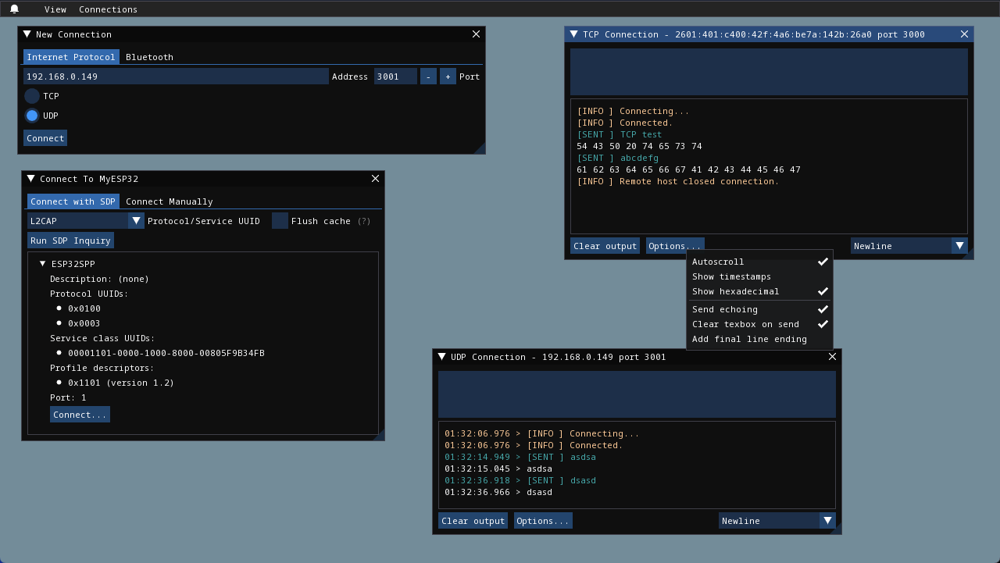

# WhaleConnect


**WhaleConnect** is an application for Internet and Bluetooth communication for Windows, Linux, and macOS.



## Documentation Links

- [Building from Source](building.md)
- [Dependencies](dependencies.md)
- [Testing](testing.md)
- [Usage](usage.md)

## Features

- Parallel connections
  - Create and manage multiple connections at the same time
  - Uses operating system features for efficiency and scalability
- Low resource usage: see system requirements
- Wide protocol support
  - TCP and UDP over IPv4 and IPv6
  - L2CAP and RFCOMM over Bluetooth
  - TLS 1.2 and 1.3 for TCP clients
- Clients
  - Create outgoing connections to other devices
  - DNS lookup for IP connections
  - Service Discovery Protocol (SDP) inquiries for Bluetooth connections
  - Create Bluetooth connections to devices paired to the computer
- Servers
  - Accept incoming connections from other devices
  - Options to view data sent from all clients and individual clients
  - Selections for clients to send data to or have connections closed
- Data view options
  - Timestamps
  - UTF-8 encoded hexadecimal
  - Logs of sent data
- Multiline textbox to send data
  - Select line ending: CR, LF, or both

## Minimum Hardware Requirements

- **Architecture:** amd64, arm64
- **Free memory:** 256 MB
- **Free disk space:** 32 MB
- **Display resolution:** 1280x720

32-bit processors are not supported.

Additional features require:

- **Network adapter** for Internet-based communication
- **Bluetooth adapter** for Bluetooth-based communication

## Software Requirements

- **Operating system:** Windows 10, macOS Ventura 13.3, Linux kernel 5.19 or higher
- **OpenGL:** 3.0 or higher
- **Windows only:** Microsoft Visual C++ 2015-2022 Redistributable
- **Recommended:** Updated drivers for your graphics card; network and Bluetooth adapter

### About Operating Systems

- The Linux kernel 5.19 is required because of `io_uring_prep_cancel_fd` and `IORING_ASYNC_CANCEL_ALL` usage. The distribution does not matter.
- WhaleConnect has not been tested on older versions of Windows and macOS than those above. While they may work, compatibility is not guaranteed.

## Installation

To install WhaleConnect, follow these steps:

1. Go to the [releases page](https://github.com/WhaleConnect/whaleconnect/releases) for this repository.
2. Under the latest version (displayed first on the page), download the ZIP file for your operating system (the files are displayed under "Assets").
3. Extract the downloaded ZIP file.
4. Run WhaleConnect as shown below.

- **On Windows:** Run `bin/WhaleConnect.exe`.
- **On Linux:** Run `bin/WhaleConnect`.
- **On macOS:** You should have a `.dmg` file after extracting the ZIP. Copy `WhaleConnect.app` out of the DMG, then run `WhaleConnect.app`.

All executables are unsigned, so you may see warnings from your operating system if you run them. On macOS, if you see a message that says "WhaleConnect is damaged and can't be opened", run the following command, then reopen the application:

```shell
xattr -c path/to/WhaleConnect.app
```

> [!NOTE]
> You do not need to download any other software or libraries as all dependencies are bundled into the package that you download.

## License

WhaleConnect and its build scripts are licensed under the [GPL v3+ license](../COPYING).

## About the Name

With their complex songs and vocalizations, whales are among the best animal communicators. They can also be found in every ocean.

This project was previously called "Network Socket Terminal" until the 1.0.0 release.
