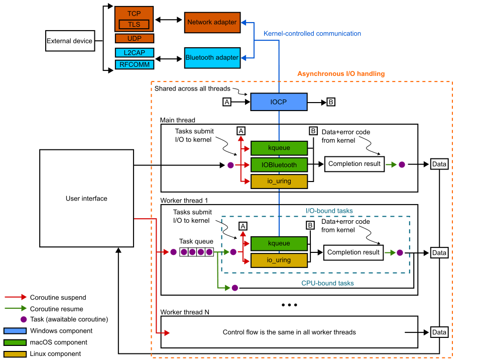

# Summary

WhaleConnect, a general-purpose and cross-platform network communication application, aims to overcome existing network communication challenges, such as data security, efficiency when handling parallel connections, and compatibility of communication between diverse technologies. It runs on Windows, macOS, and Linux, and it supports various communication protocols. Highly scalable communication is achieved through parallel processing and operating system features, and the application has an intuitive graphical user interface. Through these features, WhaleConnect is designed to foster the development of network-enabled systems and applications, such as the Internet of Things, an emerging and rapidly growing field that involves network communication and data transfer between smart devices.

# Statement of need

Computer networking is a vital component of modern computing that allows devices such as computers to communicate and share information. Having a global market size growth of 22% in 2021 to hit $157.9 billion, one emerging paradigm employing computer networking is the Internet of Things (IoT). IoT combines energy-efficient microcontrollers with sensors and actuators to create interconnected smart devices, such as smart traffic signals and automatic home lighting systems [@Elgazzar_Khalil_Alghamdi_Badr_Abdelkader_Elewah_Buyya_2022]. However, some crucial challenges in the development of IoT-based systems are security (ensuring the integrity of user data), scalability (supporting a large number of connected devices without degrading the performance of the system), and interoperability (being able to support the exchange of information across different technologies and platforms) [@Kumar_Tiwari_Zymbler_2019]. Many tools currently implement network communication for simple IoT projects, though none completely address these challenges.

This application, WhaleConnect, is an open source network communication tool that supports Windows, macOS, and Linux. It implements communication through TCP and UDP over the Internet Protocol and L2CAP and RFCOMM over Bluetooth, enabling interoperability with a wide range of IoT and wireless-enabled devices. It also supports the TLS protocol for reliable data security and encryption. Additionally, it can function as both a client and a server, allowing it to provide services and information to some devices and request them from others to offer a complete solution for control. Scalable parallel communication is enabled by leveraging resources provided by the operating system.

All functionality is exposed through a graphical user interface (GUI), offering a seamless and intuitive user experience, especially when managing multiple connections over various protocols and devices. The user interface also offers other useful functions that can aid in diagnostics, such as displaying timestamps, hex dumps, and logs of sent data. Overall, WhaleConnect addresses many key challenges in the field of IoT, promoting further research and development in this rapidly-growing field. WhaleConnect aims to be user-friendly and widely used by researchers, developers, hobbyists, and the industry.

# Architecture

WhaleConnect uses multithreading in conjunction with high-performance kernel functions — IOCP [@IO_Completion_Ports] on Windows, kqueue [@kqueue] and IOBluetooth [@IOBluetooth] on macOS, and io_uring via liburing [@Axboe_liburing_library_for] on Linux — to fully benefit from computer hardware and offer a high degree of scalability when managing multiple connections at once. In addition, it uses coroutines, introduced in the C++ 2020 standard [@Coroutines_Cpp20], to efficiently manage concurrent connections within each thread. \autoref{FIG:Architecture} presents an architecture diagram displaying the interactions between threads, the operating system's kernel, and the user interface.

# Acknowledgements

This research has received no external funding.

# References
